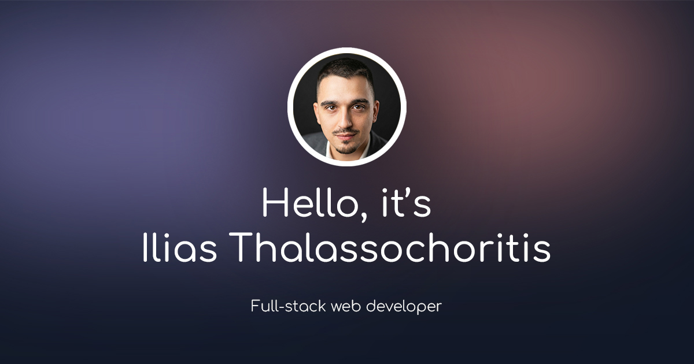

# Personal Portfolio Website



A modern, high-performance personal portfolio website built with **Next.js 16 (App Router)**, **TypeScript**, and **Tailwind CSS**. It features a clean, responsive design with smooth animations, server-side email handling, spam protection via Turnstile, and Google Analytics.

- **Live site**: `https://ilias.dev`
- **Repo**: `https://github.com/eliac7/portfolio`

---

## Table of Contents

- [Overview](#overview)
- [Features](#features)
- [Tech Stack](#tech-stack)
- [Project Structure](#project-structure)
- [Getting Started](#getting-started)
- [Environment Variables](#environment-variables)
- [Deployment](#deployment)
- [Customization](#customization)
- [Folder Overview](#folder-overview)
- [License](#license)
- [Contact](#contact)

---

## Overview

This repository contains the source code for my personal portfolio. It showcases my projects, skills, and experience in a single-page application format. The site is designed to be fast, SEO-friendly, and accessible, leveraging the latest features of the Next.js framework.

## Features

- **Responsive Navigation:** Smooth scroll navigation to sections (Home, About, Projects, Skills, Experience, Contact).
- **Theme Support:** Toggle between Light and Dark modes with persistent state.
- **Animations:** Engaging entry and scroll animations using `framer-motion` and `react-intersection-observer`.
- **Contact Form:** Secure server-side form handling using **Server Actions**, **Resend** for email delivery, and **Cloudflare Turnstile** for spam prevention.
- **Experience Timeline:** Visual timeline of work history using `react-vertical-timeline-component`.
- **Analytics:** Integrated Google Analytics for tracking visitor engagement.
- **Command Palette + Chatbot:** Quick navigation/actions via `cmdk` and an in-page chatbot UI.
- **Type Safety:** Fully typed codebase with TypeScript.

## Tech Stack

- **Framework:** [Next.js](https://nextjs.org/) (App Router)
- **Language:** [TypeScript](https://www.typescriptlang.org/)
- **Styling:** [Tailwind CSS](https://tailwindcss.com/)
- **Animations:** [Framer Motion](https://www.framer.com/motion/)
- **Email Service:** [Resend](https://resend.com/) & [React Email](https://react.email/)
- **Security:** [Cloudflare Turnstile](https://www.cloudflare.com/products/turnstile/)
- **Icons:** [React Icons](https://react-icons.github.io/react-icons/)
- **Notifications:** [React Hot Toast](https://react-hot-toast.com/)

## Project Structure

A high-level overview of the repository layout:

```text
├── actions/             # Server actions for email and captcha
├── app/                 # Next.js App Router pages and layout
├── components/          # Reusable UI components (Hero, About, etc.)
├── context/             # React Context providers (Theme, Active Section)
├── email/               # React Email templates
├── hooks/               # Custom hooks (section tracking, media queries)
├── lib/                 # Utility functions, types, and static data
├── public/              # Static assets (images, fonts)
└── ...config files      # Tailwind, Next.js, TypeScript configs
```

## Getting Started

### Prerequisites

- **Node.js** (v18.18+ recommended; v20+ also works great)
- **npm**, **yarn**, or **pnpm**

### Installation

1.  Clone the repository:

    ```bash
    git clone https://github.com/eliac7/portfolio.git
    cd portfolio
    ```

2.  Install dependencies:
    ```bash
    npm install
    # or
    yarn install
    # or
    pnpm install
    ```

### Running the development server

```bash
npm run dev
# or
yarn dev
# or
pnpm dev
```

Open [http://localhost:3000](http://localhost:3000) with your browser to see the result.

### Building for production

```bash
npm run build
npm start
```

### Linting

```bash
npm run lint
```

## Environment Variables

This project relies on a few external services. Create a `.env.local` file in the project root and add the following keys:

```env
# Resend Email Service
RESEND_API_KEY=re_123456789
RESEND_FROM_EMAIL=onboarding@resend.dev
RESEND_TO_EMAIL=your.email@example.com

# Cloudflare Turnstile (Captcha)
NEXT_PUBLIC_CLOUDFLARE_SITE_KEY=your_site_key
# Note: the secret key name is spelled CLOUDLFARE_* in the current codebase.
CLOUDLFARE_SECRET_KEY=your_secret_key

# Google Analytics
NEXT_PUBLIC_GOOGLE_ID=G-XXXXXXXXXX

# Optional (used for metadataBase / OG images)
NEXT_PUBLIC_BASE_URL=https://ilias.dev

```

## Deployment

The easiest way to deploy this Next.js app is to use the [Vercel Platform](https://vercel.com/new).

1.  Push your code to a GitHub repository.
2.  Import the project into Vercel.
3.  Add the [Environment Variables](#environment-variables) in the Vercel dashboard.
4.  Deploy!

## Customization

You can easily adapt this portfolio for your own use by modifying `lib/data.ts`. This file contains the core content:

- **Navigation Links:** `links` array.
- **Experience:** `experiencesData` array.
- **Projects:** `projectsData` array.
- **Skills:** `skillsData` array.

To change styles, refer to `app/styles/globals.css`.

## Folder Overview

- **`app/`**: Contains the main application routes. `page.tsx` assembles the sections, and `layout.tsx` handles the global layout (fonts, providers).
- **`actions/`**: Server-side logic. `sendEmailAction.ts` handles the form submission securely.
- **`components/`**: Modular components. Each section (e.g., `about.tsx`, `projects.tsx`) is self-contained. `theme-switch.tsx` handles the dark mode toggle.
- **`email/`**: Contains the `contact-form-email.tsx` template used to style the emails sent via Resend.
- **`hooks/`**: Custom hooks like `useSectionInView.ts` for tracking the active navigation link on scroll.

## License

No license is currently specified for this project.

## Contact

Ilias Nikolaos Thalassochoritis - [iliascodes@gmail.com](mailto:iliascodes@gmail.com)

Project Link: [https://github.com/eliac7/portfolio](https://github.com/eliac7/portfolio)
